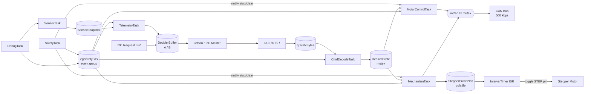

# RTOS Firmware — Architecture and Design

Complete FreeRTOS port of the RDT 2025–26 rover firmware for Teensy 4.1. All design goals met and verified. A stretch goal that was not met was stall detection through the current sensors, which proved challenging due to noise, calibration issues and insufficient data, and was deprioritized in favor of robust safety and deterministic timing. Sensor specific contants might be out of sync with the hardware, but should be easy to set and update in `rtos_config.h`.

The firmware is structured around a set of FreeRTOS tasks and ISRs, with clear ownership of shared data and synchronization primitives. The architecture emphasizes safety, real-time performance, and maintainability, while ensuring backward compatibility with the existing command protocol.

---

## Goals

- Deterministic actuator output timing, bounded independently of I2C command burst load
- Guaranteed actuator shutdown within one control period of any safety event
- Software e-stop and telemetry continue to function during hardware kill-switch e-stop
- Full backward compatibility with the existing I2C command protocol and test harness
- Task isolation so each subsystem can be modified or fail independently

---

## Architecture Decisions

1. Stepper pulse timing is owned by a hardware `IntervalTimer` ISR
2. The I2C receive ISR stays minimal: one queue push per byte, nothing else.
3. Commands are decoded into a normalized `DesiredState` struct rather than calling subsystem functions directly from the ISR path.
4. `SafetyTask` is the sole writer of the `egSafetyBits` event group, no other code sets safety bits.
5. Actuator tasks check safety bits every cycle and enforce zero output on any active stop.
6. While the hardware kill-switch is active, only `GRP_CONTROL` and `GRP_DATA` are accepted; all motion and mechanism groups are silently rejected and counted.

---

## Task Topology



---

## Task Set

| Task | Priority | Period | Responsibility |
|---|---:|---|---|
| `SafetyTask` | 7 | 5 ms | Relay read, timeout detection, `egSafetyBits` writes, hard-stop notifications |
| `MotorControlTask` | 4 | 20 ms | Speed slewing, CAN output for locomotion + excavation belt |
| `MechanismTask` | 4 | 5 ms | Stepper enable/dir, deposition door state machine, vibration motor |
| `CmdDecodeTask` | 3 | event | Queue drain, `DesiredState` writes, kill-switch gating |
| `SensorTask` | 2 | 10 ms | Current mux stepping, string pot, encoder reads → `SensorSnapshot` |
| `TelemetryTask` | 2 | 20 ms | 18-byte packet build + double-buffer swap |
| `DebugTask` | 1 | 50 ms | Teleplot serial output, diagnostic counters |

**ISRs:**

| ISR | Trigger | Constraint |
|---|---|---|
| `ISR_I2C_OnReceive` | Wire2 receive | Queue push only; `portYIELD_FROM_ISR` at exit |
| `ISR_I2C_OnRequest` | Wire2 request | Read `gTelemetryReady`, `Wire2.write()` - no RTOS calls |
| `ISR_StepperTimer` | `IntervalTimer` at 525 µs | Pin toggle only; reads `gStepperPlan` - no RTOS calls |
| `ISR_Encoders` | Quadrature edge | Counter increment - no RTOS calls |

---

## RTOS Primitives

### Queue

| Name | Type | Depth | Producer | Consumer |
|---|---|---:|---|---|
| `qI2cRxBytes` | `uint8_t` | 32 | `ISR_I2C_OnReceive` | `CmdDecodeTask` |

Overflow is counted in `diag_i2c_rx_overflow`. A non-zero count during normal operation indicates the command rate exceeds decode throughput. Did not occur during testing.

### Event Group

`egSafetyBits` written exclusively by `SafetyTask`, read by all actuator and telemetry tasks:

| Bit | Constant | Condition |
|---|---|---|
| 0 | `SAFETY_HW_ESTOP` | Relay read pin LOW — hardware kill-switch active |
| 1 | `SAFETY_SW_ESTOP` | Software e-stop command received |
| 2 | `SAFETY_COMMS_TIMEOUT` | No I2C command for ≥ 500 ms |
| 3 | `SAFETY_OVERCURRENT` | Any current channel over threshold |

`SAFETY_ANY_STOP = bits 0–3`. Any asserted bit forces actuator outputs to zero.

### Mutexes

| Name | Protects | Users |
|---|---|---|
| `mCanTx` | CAN peripheral transaction sequence | `MotorControlTask`, `MechanismTask` |
| `mDesiredState` | `DesiredState` struct | `CmdDecodeTask` (write), actuator tasks (read) |

### Task Notifications

`SafetyTask` directly notifies `MotorControlTask` and `MechanismTask`:
- Notification value `1` → hard-stop, cut outputs immediately
- Notification value `0` → all-clear, normal operation resumes

Notifications handle the immediate low-latency stop response. The event group handles persistent steady-state enforcement. Both paths are required.

---

## Shared Data Contracts

### `DesiredState`

Single source of operator intent. Only `CmdDecodeTask` writes it (under `mDesiredState`). Actuator tasks read it with a non-blocking `xSemaphoreTake(..., 0)`, and if the mutex is held they use their previous snapshot rather than blocking.

```c
typedef struct {
    float    loco_left_target;    // normalized -1..1 after duty scaling
    float    loco_right_target;
    float    excav_belt_target;   // normalized -1..1
    int8_t   excav_vert_dir;      // -1=down, 0=stop, +1=up
    int8_t   depo_door_cmd;       // -1=close, 0=hold, +1=open (consumed on use)
    int8_t   depo_vib_cmd;        // 0=off, 1=on
    uint32_t last_cmd_ms;         // millis() at last received command
    bool     sw_estop_requested;  // set by CmdDecodeTask, consumed by SafetyTask
} DesiredState;
```

### `SensorSnapshot`

Written by `SensorTask` (single writer, no mutex needed). `TelemetryTask` takes a snapshot copy for packet assembly. `MechanismTask` reads `string_pot_cm` for over-travel enforcement.

### `StepperPulsePlan`

Shared between `MechanismTask` (writes direction and enable) and `ISR_StepperTimer` (reads). Fields are `volatile uint8_t` — writes are single-byte atomic on Cortex-M7, no critical section needed.

### Telemetry Double Buffer

`gTelemetryBuf[2][18]` with a `volatile uint8_t gTelemetryReady` index. `TelemetryTask` writes to the inactive buffer (`1 - gTelemetryReady`), then sets `gTelemetryReady` atomically. `ISR_I2C_OnRequest` reads `gTelemetryReady` and sends that buffer.

---

## Hardware-Timed Stepper

The `IntervalTimer` fires every 525 µs (half the nominal step period). Each invocation toggles the STEP pin if `gStepperPlan.enabled == 1`, producing one full step pulse per two invocations. `MechanismTask` sets direction and enable; the ISR only reads them and toggles a pin.

ISR constraints: no RTOS calls, no dynamic allocation, no prints. `digitalWriteFast` keeps the ISR constant-time.

---

## Command Gating Policy

`CmdDecodeTask` enforces kill-switch gating before writing to `DesiredState`:

```
if SAFETY_HW_ESTOP active:
    allow groups:  GRP_CONTROL, GRP_DATA
    reject groups: GRP_LOCO_STOP, GRP_FORWARD, GRP_BACKWARD, GRP_LEFT,
                   GRP_RIGHT, GRP_EXCAVATION, GRP_DEPOSITION
    increment diag_cmd_rejected_killswitch on each rejected command
else:
    process all groups normally
```

Software e-stop (`GRP_CONTROL param=0x1`) zeroes all targets in `DesiredState` and sets `sw_estop_requested`, which `SafetyTask` consumes and latches into `SAFETY_SW_ESTOP` on its next cycle — keeping `SafetyTask` as the sole bit writer.

---

## String Pot Over-Travel Enforcement

`MechanismTask` applies hysteresis latching to prevent limit-bounce from re-enabling arm movement:

- If `string_pot_cm >= STRPOT_HIGHEST_CM`: latch `strpotHighLatched = true`; block upward (`vertDir > 0`) movement
- If `string_pot_cm <= STRPOT_LOWEST_CM`: latch `strpotLowLatched = true`; block downward (`vertDir < 0`) movement
- Latch is cleared only when the pot reads back past the threshold by `STRPOT_HYST_CM`
- If the pot reads above `STRPOT_FAULT_HIGH_CM` (sensor disconnected or railed), block all vertical movement

---

## Diagnostic Counters

All counters are `volatile uint32_t`, defined in `shared_state.cpp`. ISR writers are single-writer (no torn write risk on 32-bit Cortex-M7). Tasks reading counters for display should snapshot inside `taskENTER_CRITICAL()` to avoid a torn read.

| Counter | Incremented by | Meaning |
|---|---|---|
| `diag_i2c_rx_overflow` | `ISR_I2C_OnReceive` | Byte dropped -  queue full |
| `diag_cmd_rejected_killswitch` | `CmdDecodeTask` | Motion command blocked by HW e-stop |
| `diag_cmd_invalid` | `CmdDecodeTask` | Unrecognized group or out-of-range param |
| `diag_timeout_events` | `SafetyTask` | Comms timeout transitions (leading edge only) |
| `diag_safety_transitions` | `SafetyTask` | Any-stop bit asserted (leading edge) |
| `diag_telemetry_serialize_errors` | `TelemetryTask` | Packet build errors |
| `diag_i2c_short_packets` | `ISR_I2C_OnRequest` | `Wire2.write()` returned fewer bytes than expected |

---

## Acceptance Criteria

All criteria were verified on hardware before this firmware was considered complete.
- [x] With hardware kill-switch active: motion stopped immediately; data requests return an 18-byte packet; `GRP_CONTROL` is accepted; motion groups are rejected and `diag_cmd_rejected_killswitch` increments
- [x] Comms timeout: no command for 500 ms sets `SAFETY_COMMS_TIMEOUT`; actuator outputs reach zero within one control period (≤ 20 ms)
- [x] Stepper pulse jitter is bounded by the timer ISR and does not vary with I2C command burst load (verified with logic analyzer)
- [x] No queue overflows at normal command rate (`diag_i2c_rx_overflow` remains 0 during operation)
- [x] `i2c_parent` WASD commands operate the rover without protocol remapping
- [x] `GRP_DATA` response is exactly 18 bytes (verified with `requestFrom(addr, 18)` + `Wire.available() == 18`)
- [x] Pin assignments match the superloop `pins.h` (cross-checked before first power-on)
- [x] Multi-byte command extensions use named constants for all axis/register mappings
